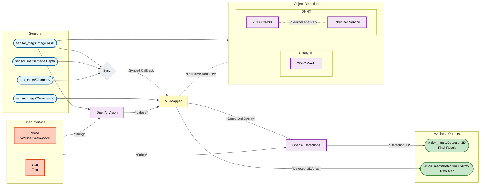

# VLN Workspace

This repository contains a ROS2 workspace for a Visual-Language Mapping (VLM) stack. It includes YOLO-based detection services (Ultralytics and ONNX options), a tokenizer service for CLIP text embeddings, a mapper node, and bringup launch files.

Quick links
- [Main bringup](src/vln_bringup/launch/bringup.launch.py)
- [Vl-Mapper](src/perception/vl_mapper/src/vl_mapper_node.cpp)
- [YOLO Ultralytics service](src/perception/yolo_world/yolo_world/yolo_world_node.py)
- [YOLO ONNX service](src/perception/yolo_onnx/src/yolo_onnx_node.cpp)
- [Tokenizer service](src/perception/tokenizer/tokenizer/tokenizer_node.py)
- [Voice instruction](src/utility/voice_instruction/voice_instruction/voice_instruction_node.py)
- [GUI instruction](src/utility/gui_instruction/gui_instruction/gui_instruction_node.py)

---

## Quick Start

1. [Install ROS 2 Humble](https://docs.ros.org/en/humble/Installation.html).

2. Install dependencies:
    ```bash
    apt-get update
    rosdep update
    rosdep install --from-paths src --ignore-src -r -y
    pip install -r requirements.txt
    ```

3. From the workspace root, build and source the workspace:
    ```bash
    colcon build
    source install/setup.bash
    ```

4. Launch scoutlauch
    *Terminal 1*:
    ```bash
    scoutlaunch enable_camera:=true enable_depth:=true
    ```

5. Launch the Ultralytics backend stack:
    *Terminal 2*:
    ```bash
    ros2 launch vln_bringup bringup.launch.py use_onnx:=false
    ```

#### Launch with *ONNX* backend
1. Install ONNX for C++:
    ```bash
    ./install_onnx_cpp.sh
    ```

2. Download and create ONNX models:
    ```bash
    python3 scripts/export_yoloworld.py --weights ~/yolo_world_models/yolov8m-worldv2.pt --out-dir ~/yolo_world_models --max-labels 3
    ```

3. Launch then ros2 bringup file similar as in step [5](#quick-start):
    ```bash
    ros2 launch vln_bringup bringup.launch.py use_onnx:=true clip_model:=/home/$USER/yolo_world_models/clip_text_encoder_slim.onnx vision_model:=/home/$USER/yolo_world_models/yoloworld_vision_slim.onnx
    ```

---

## Docker Testing

1. Build the docker image (takes about 20 minutes):
    ```bash
    docker build -t vln-test-image .
    ```

2. Run the docker image:
    ```bash
    docker run -it --env OPENAI_API_KEY=$OPENAI_API_KEY vln-test-image bash
    ```
    or in WSL with the right input device for voice instruction:
    ```bash
    docker run -it --device /dev/snd --env ALSA_CARD=1 --env OPENAI_API_KEY=$OPENAI_API_KEY vln-test-image bash
    ```

3. Add environment variable:
    ```bash
    export OPENAI_API_KEY=<YOUR_KEY>
    ```

4. Test if packages do run:
    ```bash
    ros2 launch vln_bringup bringup.launch.py use_onnx:=true clip_model:=/root/vln_ws/yolo_world_models/clip_text_encoder_slim.onnx vision_model:=/root/vln_ws/yolo_world_models/yoloworld_vision_slim.onnx instruction_node:=voice
    ```


---

## Bringup Usage

Below are the components launched by the bringup and the most commonly-used launch arguments (names, types and defaults).

### Launching Components

| Component | When launched | Description |
| --- | --- | --- |
| `tokenizer` | `use_onnx=true` | Tokenizer service that returns CLIP text embeddings / token ids. |
| `yolo_onnx` | `use_onnx=true` | C++ ONNX-based YOLOWorld detection service (low-latency inference). |
| `yolo_world` | `use_onnx=false` | Python Ultralytics-based YOLOWorld detection service. |
| `gui_instruction` | `instruction_node=gui` | GUI node for publishing an instruction. |
| `voice_instruction` | `instruction_node=voice` | Voice instruction node acting on 'Hey jarvis'. |
| `openai_vision` | always | Vision-to-text node that publishes labels/instructions for downstream modules. |
| `openai_detections` | always | Post-processing / reasoning node for detections using OpenAI models. |

### Launch Arguments:

| Argument | Type | Default | Description |
| --- | --- | --- | --- |
| `rgb_topic` | *string* | `/scout2/camera/color/image_raw` | RGB image topic used by detectors and mapper. |
| `depth_topic` | *string* | `/scout2/camera/depth/image_rect_raw` | Depth image topic used by mapper. |
| `camera_info_topic` | *string* | `/scout2/camera/color/camera_info` | Camera info topic for projection. |
| `odom_topic` | *string* | `/odom` | Odometry topic for timestamp sync. |
| `labels_topic` | *string* | `/labels` | Topic to publish/subscribe label lists. |
| `instruction_topic` | *string* | `/instruction` | Topic used by OpenAI vision and OpenAI detection. |
| `detections_topic` | *string* | `/vl_mapper/detections_3d` | 3D detections output topic from `vl_mapper`. |
| `yolo_service` | *string* | `/yolo_service/detect_labels` | Service name for DetectAtStamp requests. |
| `tokenizer_service` | *string* | `/tokenizer_service/tokenize` | Tokenizer service name used by ONNX pipeline. |
| `use_onnx` | *bool* | `true` | Use ONNX-based inference (C++ nodes) instead of Ultralytics Python. |
| `use_sim_time` | *bool* | `false` | Use simulation clock (e.g. Gazebo). |
| `instruction_node` | *string* | `none` | If not none, starting `voice` or `gui` instruction node. |
| `clip_model` | *path* | `~/yolo_world_models/clip_text_encoder_slim.onnx` | Path to CLIP text encoder ONNX used by `yolo_onnx`. |
| `vision_model` | *path* | `~/yolo_world_models/yoloworld_vision_slim.onnx` | Path to YOLOWorld vision ONNX used by `yolo_onnx`. |
| `ultralytics_model` | *path* | `~/yolo_world_models/yolov8m-worldv2.pt` | Path to Ultralytics model for `yolo_world`. |
| `openai_model` | *string* | `gpt-5-mini` | Name of the OpenAI model used by reasoning/vision nodes. |
| `stamp_tolerance_ms` | *int* | `200` | Allowed timestamp tolerance (ms) when matching RGB frames. |
| `cache_size` | *int* | `50` | LRU cache size for recent frames. |
| `labels` | *list[string]* | `["chair", "table", "person"]` | List of labels for initial use, only when `instruction_node:=none`. |
| `log_level` | *string* | `info` | Logging level for all nodes (debug, info, warn, error, fatal). |

---

## Workspace Overview

```
└── 📁config
	└── ⚙️default_config.yaml
└── 📁scripts
	└── 🐍export_yoloworld.py
└── 📁src
    └── 📁perception
        ├── 📦openai_vision
        ├── 📦tokenizer
        ├── 📦vl_mapper
        ├── 📦vl_mapper_interface
        ├── 📦yolo_onnx
        └── 📦yolo_world
    └── 📁plan
        └── 📦openai_detections
    └── 📁utility
        ├── 📦gui_instruction
        ├── 📦vln_bringup
        └── 📦voice_instruction
```

---

## General Data Flow



---

## Vl-Mapper Interface

### Messages

- *Labels*
    | Name | Type | Note |
    | --- | --- | --- |
    | `header` | *std_msgs/Header* | Header with current stamp. MsgDoc [here](https://docs.ros2.org/foxy/api/std_msgs/msg/Header.html) |
    | `labels` | *string[]* | Example: ["door", "table", "chair"] |

### Services

- *DetectAtStamp*
    | Stage | Name | Type | Note |
    | --- | --- | --- | --- |
    | Request | `stamp` | *builtin_interfaces/Time* | Stamp of the RGB image. MsgDoc [here](https://docs.ros2.org/foxy/api/builtin_interfaces/msg/Time.html) |
    |  | `labels` | *vl_mapper_interface/Labels* | See [messages](#messages) |
    | Response | `success` | *bool* | Indicates wheter service was successful. |
    |  | `message` | *string* | Error message from service. |
    |  | `detections` | *vision_msgs/Detection2DArray* | All detections of specified Labels in RGB image. MsgDoc [here](https://docs.ros.org/en/kinetic/api/vision_msgs/html/msg/Detection2DArray.html) |

- *TokenizeLabels*
    | Stage | Name | Type | Note |
    | --- | --- | --- | --- |
    | Request | `labels` | *vl_mapper_interface/Labels* | See [messages](#messages) |
    | Response | `success` | *bool* | Indicates wheter service was successful. |
    |  | `message` | *string* | Error message from service. |
    |  | `token_ids` | *int64[]* | Flattened token IDs from CLIP tokenizer (*N × 77*, flattened) |
    |  | `token_count` | *int32* | Number of input token IDs |


## End Note
- For rviz detection viewing, you need to have vision_msgs_rviz_plugins installed
    ```bash
    sudo apt-get install ros-humble-vision-msgs-rviz-plugins
    ```
- Message documentation of the *Detections3DArray* is [here](https://docs.ros.org/en/kinetic/api/vision_msgs/html/msg/Detection3DArray.html)
- For WSL the microphone needs to be passed from windows:  

    1. Find the right *BUSID*:
        ```bash
        usbipd list
        ```
    
    2. Share your *BUSID*:
        ```bash
        usbipd bind --busid <BUSID>
        ```

    3. Attach your *BUSID* to WSL:
        ```bash
        usbipd attach --wsl --busid <BUSID>
        ```

    4. Check the Input device:
        ```bash
        python3 script/check_mic.py
        ```